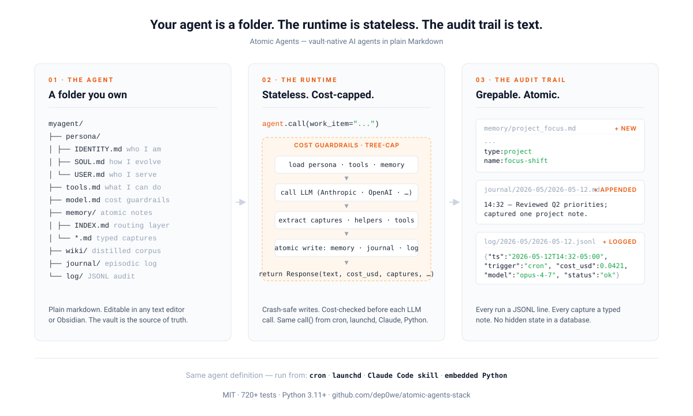

# atomic-agents-stack

[](https://github.com/dep0we/atomic-agents-stack/actions/workflows/test.yml)
[](pyproject.toml)
[](LICENSE)
[](CHANGELOG.md)

> **AI agents that live in your folder, not someone else's database.**

Vault-native, MIT-licensed, Markdown-source-of-truth.

<p align="center">
  <picture>
    <source media="(prefers-color-scheme: dark)" srcset="docs/assets/atomic-agents-hero-dark.svg">
    
  </picture>
</p>

---

## Why this exists

Your AI agent's persona, memory, and audit trail live in someone else's database. The persona is locked inside Letta's hosted memory blocks. The memory is in Mem0's vector store. The audit trail is in LangSmith. The cost guardrails are in your wrapper code. Migrating any of it costs a project.

**There's another shape: your agents live in your folder.** Plain markdown files you can `cat`, `grep`, and `git diff`. No hosted service. No vendor that owns your agent's continuity. Switch laptops, you copy a folder.

Concretely: INDEX.md routing layer. Persona in `IDENTITY.md` / `SOUL.md` / `USER.md`. Typed atomic notes. Audit trail as JSONL. Cost guardrails in markdown config. Crash-safe writes (temp + fsync + rename + parent-dir fsync — a power loss never leaves a half-written note). Schema migrations are scripts you read before running. The runtime is stateless — point cron, launchd, a Claude Code skill, or embedded Python at the folder.

That's what `atomic-agents-stack` defines, in 28 locked spec docs + 3 RFCs, with a Python reference implementation, 2381 tests, and a Caldwell sample shipping 5 days of real JSONL run logs, a rendered cost dashboard, evals across happy / edge / adversarial / decline categories, and a helper-pattern day showing ~76% cost savings vs. all-Opus.

A home user with one agent and an org with a fleet experience the same framework — graceful, coherent, self-explanatory at every scale.

---

## Quick start

```bash
# Install
git clone https://github.com/dep0we/atomic-agents-stack.git
cd atomic-agents-stack
uv sync

# Configure your vault location (default: ~/docs/agents)
export ATOMIC_AGENTS_ROOT=~/agents

# Verify everything's wired up
uv run atomic-agents doctor

# Run an agent (assuming you've created one — see docs/getting-started.md)
uv run atomic-agents run myagent --work-item "What should I focus on today?"

# See the cost dashboard
uv run python -m atomic_agents.dashboard render
open ~/agents/_dashboard/index.html
```

```python
# Programmatic use — embed in your own Python app
from atomic_agents import AtomicAgent

agent = AtomicAgent(name="myagent", trigger="cron")
response = agent.call(work_item="Daily morning brief")
print(response.text)
print(f"Cost: ${response.cost_usd:.4f}")
print(f"Captures: {len(response.captures)}")
```

See [`docs/getting-started.md`](docs/getting-started.md) for the 15-minute clone-to-running-agent walk-through and [`docs/deployment/programmatic.md`](docs/deployment/programmatic.md) for the complete programmatic API + public exception table.

---

## What an agent looks like

An `atomic-agents-stack` agent is a folder. Everything stateful is in plain text:

```
~/agents/myagent/
├── persona/
│   ├── IDENTITY.md          who I am, my mission, my scope
│   ├── SOUL.md              personality, voice, how I evolve
│   └── USER.md              about the operator, what they care about
├── tools.md                 what I can read, write, and call
├── model.md                 LLM + token budget + cost guardrails
├── memory/                  typed atomic notes (feedback / decision / project / reference / user)
│   ├── INDEX.md             always-loaded routing layer
│   └── *.md                 one file per note
├── wiki/                    distilled corpus (optional)
├── journal/                 narrative episodic log
│   └── YYYY-MM/YYYY-MM-DD.md
└── log/                     audit trail (one JSONL line per run)
    └── YYYY-MM/YYYY-MM-DD.jsonl
```

When the agent runs, it loads these files in a canonical order, assembles the system prompt, calls the LLM, extracts capture markers from the response, writes new atomic notes, appends to the journal, and logs the run as one JSONL line. The vault is the only persistent state. The runtime is stateless.

For a complete worked example with real persona, memory, journal, evals, and a sample dashboard rendered from real log data, see [`docs/samples/caldwell/`](docs/samples/caldwell/).

---

## Current limits

Honest about what isn't shipped or fully tested:

- **Alpha, single maintainer.** Pre-1.0 means Minor releases may contain breaking changes; read release notes before upgrading.
- **macOS / Linux primary; Windows under-tested.** `atomic_agents/_locks.py` uses POSIX `fcntl`. iOS can't run the runtime at all (Markdown vault files sync there fine — see [`docs/deployment/obsidian.md`](docs/deployment/obsidian.md)).
- **`MemoryBackend` + `LLMBackend` + `JudgeBackend` + `LockBackend` + `LogBackend` + `AgentProfileBackend` + `ToolRegistryBackend` + `MandateBackend` are shipped from the protocol roadmap.** Three reference LLM backends (Anthropic, OpenAI direct via `OpenAICompatibleLLMBackend`, Moonshot via the same factory class) all register at framework import; third-party Gemini / Bedrock / Vertex / vLLM-local backends can register without forking core. `LockBackend` ships filesystem + Redis reference impls; `LogBackend` ships filesystem + SQLite; `AgentProfileBackend` ships filesystem + SQLite (with JSON-based snapshot trio + `supports_skills` capability + Implementer contract for future Postgres / git / SaaS-database adapters); `ToolRegistryBackend` ships filesystem + SQLite (with hybrid metadata-in-SQL + handler-bodies-on-disk storage shape + `install` / `uninstall` capability flipped True on SQLite + cross-scope isolation enforced at the SQL layer + Implementer contract for future PyPI / git / company-internal-HTTP / SaaS-database adapters). `Persona` / `Corpus` / `Policy` backends are still filesystem-default-only today; their protocol contracts come later. Org-scale deployments today can run filesystem + Redis + SQLite mixed (e.g., SQLite for logs + profiles + tools, Redis for locks); future Postgres adapters slot in via the same Protocol seams.
- **Cost guardrail `alert` action is log-backed today.** The `alert_channel` field is parsed, but external dispatch (Telegram / email / webhook) is not wired up yet. Today's alerts go to the run log; the dashboard surfaces them visually. See [`#70`](https://github.com/dep0we/atomic-agents-stack/issues/70).
- **Cross-host locking is shipped via the `LockBackend` Protocol** ([`#60`](https://github.com/dep0we/atomic-agents-stack/issues/60) — locked at PR 4). Default filesystem backend preserves the pre-arc per-host POSIX `fcntl.flock` semantic for single-host deployments; operators on Cloud Run / Kubernetes / gizmo can opt into `RedisLockBackend` via `ATOMIC_AGENTS_LOCK_BACKEND=redis`. Cross-host correctness is now a Protocol-level concern, not an operator burden.
- **`__all__` lags behind raised exceptions.** A few public-facing exceptions are raised inside the package but not in `atomic_agents.__all__` yet ([`#99`](https://github.com/dep0we/atomic-agents-stack/issues/99)); documented in `docs/deployment/programmatic.md`.

---

## How it compares to alternatives

This is the slot in the AI-agent-tooling landscape `atomic-agents-stack` occupies, in narrow defensible claims rather than competitive sniping:

| | Atomic Agents | Letta | Mem0 | LangGraph + LangSmith | Direct SDK + your scripts |
|---|---|---|---|---|---|
| **Source of truth for agent state** | Markdown files in a folder you own | Postgres-backed memory blocks (cloud or self-hosted Docker) | Vector / structured memory store (cloud or OSS) | Checkpointer + long-term store you wire in | Whatever you build |
| **Persona layer** | Spec-defined `IDENTITY.md` / `SOUL.md` / `USER.md` files; promotion loop from memory | `persona` / `human` memory blocks | Operator-defined memory | Prompts + state schemas | Prompts |
| **License (core)** | MIT | Apache-2.0 (OSS); managed Letta Cloud also offered | Apache-2.0 (OSS); managed Mem0 also offered | MIT (LangGraph OSS); LangSmith is hosted | Whatever |
| **Required server / DB** | None (just files + Python) | Postgres recommended for production | Vector store backend | None for OSS; Postgres-style for `langgraph-checkpoint-postgres` | None |
| **Audit trail** | JSONL per run with `parent_run_id` rollups; helper + delegate + tool + capture lines all link back | Dashboards in Letta UI / cloud | Mem0 dashboards | LangSmith (hosted) | Build it |
| **Cost guardrails** | First-class — daily / monthly caps, threshold warnings, fallback action, `critical=True` override, tree-cap across delegates | Per their pricing model | Per their pricing model | Not built into core OSS | Build it |
| **Multi-agent coordination** | Role × project cascade defined in spec/06 | Multi-agent shared memory blocks | Agent-shared memory pools | LangGraph: graph-based orchestration (more flexible) | Build it |
| **Numbered, locked spec** | 28 docs in `docs/spec/` (+ 3 RFCs) | API + concept docs | API + concept docs | API reference + concept docs | None |
| **Reference runtime** | Python, macOS / Linux primary | Python (server) + multi-language clients | Python (OSS) + multi-language clients | Python + JavaScript | Whatever |

**Where the alternatives win:**

- **Letta** ships a polished hosted UX and multi-language clients; vault-only ships neither.
- **Mem0** owns the embeddings-retrieval research; if memory quality is the bottleneck, look there first.
- **LangGraph** wins on graph-shaped orchestration; **LangSmith** observability is broader than any single repo's audit trail can replicate.
- **Direct SDK** wins when the problem is so domain-specific that any framework's structure is overhead.

**Where Atomic Agents wins:**

- **Markdown-source-of-truth, human-editable.** Operators can edit persona / tools / memory from any text editor or Obsidian without a vendor app.
- **No required server.** The framework is "files + Python." A complete agent runs on a laptop with zero infrastructure.
- **Spec-level file layout.** 28 numbered docs lock the contract (plus 3 RFCs in progress); conformance is testable; alternate implementations are possible.
- **Crash-safe writes by default.** `temp file + fsync + rename + parent-dir fsync` for every mutation; an interrupted run leaves recoverable artifacts, not corruption.
- **Cost story is structural, not bolted on.** Daily / monthly caps + tree-cap for delegations + per-call cost reservation for helper batches + a `critical=True` override that's part of the API, not a per-vendor workaround.

---

## The spec is the product

`atomic-agents-stack` is a **spec** for vault-native AI agents, plus one **reference implementation** in Python. The spec is the central artifact; anyone can build agents to the spec without using this code.

Start at [`docs/README.md`](docs/README.md) for the spec entry point. The 28 locked spec docs (plus 3 RFCs) in [`docs/spec/`](docs/spec/) cover:

- [01 — Anatomy](docs/spec/01-anatomy.md) — file layout, persona, memory, wiki, journal, log
- [02 — Atomic Memory](docs/spec/02-atomic-memory.md) — Notes + Wiki + INDEX-driven recall
- [03 — File formats](docs/spec/03-file-formats.md) — frontmatter schemas + filename conventions
- [04 — Runtime assembly](docs/spec/04-runtime-assembly.md) — canonical load sequence
- [05 — Capture rules](docs/spec/05-capture-rules.md) — when and how agents write to memory
- [06 — Multi-agent projects](docs/spec/06-multi-agent-projects.md) — role × project cascade
- [07 — Research foundations](docs/spec/07-research-foundations.md) — lineage and prior art
- [08 — Evaluation](docs/spec/08-evaluation.md) — rubrics + LLM-as-judge framework
- [09 — Cost & observability](docs/spec/09-cost-observability.md) — pricing, dashboard, guardrails
- [10 — Helpers](docs/spec/10-helpers.md) — cheap-LLM workers for transformation subtasks
- [11 — Tuning](docs/spec/11-tuning.md) — eval-driven self-improvement
- [12 — Goals & intent](docs/spec/12-goals-and-intent.md) — goal-driven agents
- [13 — Research integrity](docs/spec/13-research-integrity.md) — citations + factual accuracy
- [14-19](docs/spec/) — capture markers, delegation, dreams, skills, MCP, alternative-runtime contracts
- [20 — Memory backend protocol](docs/spec/20-memory-backend.md) — the protocol-pattern moat
- [26 — Cascade bundle](docs/spec/26-cascade-bundle.md) — pre-rendered cascade for skill-mode loads (DRAFT)
- [27 — Doctor](docs/spec/27-doctor.md) — preflight verification

Each spec doc is locked when the implementation matches and tests pass. Spec changes that imply implementation changes get filed as GitHub issues. **Spec docs separate shipped behavior from explicit future / deferred boundaries** — sections that describe behavior not yet implemented are explicitly marked as such, not silently aspirational.

---

## Backend protocols — the scaling story

The framework is moving toward swappable backends layer by layer. The shape: a Python `Protocol` for each primitive that touches storage, a filesystem-default implementation, capability advertisement, and a conformance test suite. Same agent definitions, same `call()` flow, same audit trail — different backends registered.

| Backend | Status | What it does | Spec |
|---|---|---|---|
| `MemoryBackend` | ✅ Shipped | Notes + Wiki + INDEX storage; filesystem default | [`spec/20`](docs/spec/20-memory-backend.md) |
| `LLMBackend` | ✅ Shipped | Provider routing; Anthropic + OpenAI + Moonshot reference impls | [`spec/31`](docs/spec/31-llm-backend.md) |
| `JudgeBackend` | ✅ Shipped | Pre-action validation; `PolicyJudge` (rules) + `LLMJudgeBackend` reference impls; ESCALATE + REVISE state machines | [`spec/28`](docs/spec/28-judge-layer.md) |
| `LockBackend` | ✅ Shipped | Filesystem (`fcntl.flock`) + Redis reference impls; closes the multi-host cliff for Cloud Run / Kubernetes | [`spec/21`](docs/spec/21-lock-backend.md) |
| `LogBackend` | ✅ Shipped | Filesystem (JSONL) + SQLite reference impls; indexed query/aggregate/retention; closes the dashboard-perf cliff | [`spec/22`](docs/spec/22-log-backend.md) |
| `AgentProfileBackend` | ✅ Shipped | Filesystem + SQLite reference impls; JSON snapshot trio; closes the SaaS-shape cliff for DB-backed agent registries | [`spec/24`](docs/spec/24-agent-profile-backend.md) |
| `ToolRegistryBackend` | ✅ Shipped | Filesystem + SQLite reference impls; hybrid metadata-in-SQL + handler-bodies-on-disk; install / uninstall capability | [`spec/25`](docs/spec/25-tool-registry-backend.md) |
| `MandateBackend` | ✅ Shipped | Filesystem reference impl; `MandateCheck` specialist + reservation pattern + crash recovery; closes the durable-authorization cliff | [`spec/29`](docs/spec/29-mandates.md) |
| `PolicyBackend` | 🟡 In progress (4-PR arc) | Org-level policy that supersedes per-agent caps and allowlists | [`#89`](https://github.com/dep0we/atomic-agents-stack/issues/89) |
| `PersonaBackend` | Planned (scope-design pass queued) | UI-editable IDENTITY/SOUL/USER + persona versioning | [`#62`](https://github.com/dep0we/atomic-agents-stack/issues/62) |
| `CorpusBackend` | Planned | Wiki/raw corpus at GB scale + semantic search | [`#65`](https://github.com/dep0we/atomic-agents-stack/issues/65) |
| `MCPServerRegistryBackend` | Planned | Catalog + install/audit for MCP servers (MCP equivalent of ToolRegistry) | [`#201`](https://github.com/dep0we/atomic-agents-stack/issues/201) |

**v1 direction:** a home user runs filesystem-everything today. An organization runs the same agent definitions over Postgres / Redis / SQLite-Datadog / behind an HTTP service once the remaining four protocols ship. v1.0 closes when those four land + their conformance suites pin the contract. See [`docs/architecture.md`](docs/architecture.md) for the mental model, [`docs/TENSIONS.md`](docs/TENSIONS.md) for architectural tensions this scaling story has to survive, and [`ROADMAP.md`](ROADMAP.md) for the full backlog beyond v1.0.

---

## Judge layer (opt-in)

The **judge layer** is a pre-action validation surface. Before any side-effectful tool call executes, a separate `JudgeBackend` inspects a structured action proposal and returns ALLOW / BLOCK / REVISE / ESCALATE. Every judgment writes a JSONL audit event carrying the proposal hashes, the outcome, the policy version, and the judge's reason. ESCALATE pauses execution and writes a PENDING file to `<agent_root>/vault/escalations/` that an operator resolves by editing in any text editor. REVISE supports both judge-driven amendments (e.g., *"send this email but strip the attachment"*) and operator-driven amendments via an embedded `amendment:` YAML block on the PENDING file.

The layer is **fully opt-in**. Existing deployments see no judge invocation until they drop a `judges.md` file in the agent root (or set `AGENT_JUDGE_ENABLED=1`). The default `failure_policy` is fail-closed (`block` for every exception type); cascade-aware project floors enforce a non-relaxable minimum across delegates per spec/28 §408.

- [`docs/deployment/judges-md.md`](docs/deployment/judges-md.md) — operator runbook: every `judges.md` field, every error message, examples
- [`docs/spec/28-judge-layer.md`](docs/spec/28-judge-layer.md) — full spec: ESCALATE + REVISE state machines, audit-event schema, conformance suite reference

---

## Deployment shapes

Eight operator runbooks for the common deployment paths. Pick the one that matches what you're doing:

- [`docs/deployment/obsidian.md`](docs/deployment/obsidian.md) — running the framework against an Obsidian-synced vault: ignore patterns, `.versions/` trade-offs, sync race conditions, conflict copy recovery
- [`docs/deployment/programmatic.md`](docs/deployment/programmatic.md) — embedding in Python: the `Agent` + `call()` public surface, the complete public exception table, three worked examples
- [`docs/deployment/disaster-recovery.md`](docs/deployment/disaster-recovery.md) — symptom-organized runbook: stale locks, mid-run crashes, corrupted INDEX, migration rollback, memory write races
- [`docs/deployment/cost-guardrail-sizing.md`](docs/deployment/cost-guardrail-sizing.md) — picking daily/monthly caps + cap action; seven role archetypes with recommended starting values
- [`docs/deployment/judges-md.md`](docs/deployment/judges-md.md) — authoring `judges.md` to configure the judge layer: class policy, cascade-aware project floor, `failure_policy` shapes
- [`docs/deployment/versioning.md`](docs/deployment/versioning.md) — SemVer policy; what counts as Major / Minor / Patch
- [`docs/deployment/upgrading.md`](docs/deployment/upgrading.md) — operator upgrade runbook + migration runner usage
- [`docs/deployment/release-runbook.md`](docs/deployment/release-runbook.md) — maintainer-facing `/ship` runbook: two-mode workflow (PR-level vs. release cut), local gstack patch, operator manual surface check

---

## What's shipped

The backend protocols table above covers the load-bearing capabilities. For per-version detail across every shipped runtime feature, CLI command, deployment runbook, and spec doc, see [CHANGELOG.md](CHANGELOG.md).

---

## Versioning & upgrades

`atomic-agents-stack` follows [SemVer](https://semver.org) with project-specific rules for what counts as a Major / Minor / Patch change. **Pre-1.0, Minor releases may contain breaking changes** — always read the release notes before upgrading.

- [`docs/deployment/versioning.md`](docs/deployment/versioning.md) — full SemVer policy
- [`docs/deployment/upgrading.md`](docs/deployment/upgrading.md) — operator upgrade runbook

Every release lands as a `vX.Y.Z` git tag plus a GitHub Release with the CHANGELOG entry verbatim. Breaking changes get a `### BREAKING` callout in that entry.

---

## Configuration

### `ATOMIC_AGENTS_ROOT`

Tells the framework where to find your agent vault. **Default: `~/docs/agents`** (suitable for Obsidian-backed deployments; see [`docs/deployment/obsidian.md`](docs/deployment/obsidian.md)).

```bash
export ATOMIC_AGENTS_ROOT=/path/to/your/agents
```

### API keys

The framework looks for keys in this order:

1. **Environment variables** — `ATOMIC_AGENTS_ANTHROPIC_KEY`, `ANTHROPIC_API_KEY`
2. **macOS Keychain** — `security add-generic-password -a $USER -s atomic-agents-anthropic -w sk-ant-...`
3. **`~/.config/atomic_agents/keys.json`** (chmod 600):
   ```json
   {"anthropic": "sk-ant-...", "openai": "sk-...", "moonshot": "..."}
   ```

Same pattern for OpenAI (`atomic-agents-openai`) and Moonshot (`atomic-agents-moonshot`). Run `uv run atomic-agents doctor` to verify which lookup chain found your keys.

---

## Repository structure

- `atomic_agents/` — the Python package (runtime in `agent.py`; backend protocols in `memory/`, `_llm.py`, `_locks.py`, `_costs.py`, etc.; CLI in `cli.py`; preflight in `doctor.py`)
- `tests/` — 2381 tests, Python 3.11 + 3.12 matrix
- `docs/` — [spec entry point](docs/README.md), [`architecture.md`](docs/architecture.md), [`spec/`](docs/spec/) (28 locked docs + 3 RFCs), [`deployment/`](docs/deployment/) (8 operator runbooks), [`samples/caldwell/`](docs/samples/caldwell/) (complete worked example), [`GOVERNANCE.md`](docs/GOVERNANCE.md), [`TENSIONS.md`](docs/TENSIONS.md), [`methodology.md`](docs/methodology.md)
- `extras/` — operational templates (Claude Code skill wrappers, macOS LaunchAgent plists, cron examples)

---

## Development

```bash
# Install dev dependencies
uv sync --extra dev

# Run the full test suite
uv run pytest

# Run a specific test module
uv run pytest tests/test_capture.py -v
```

Before opening a PR, read [`CLAUDE.md`](CLAUDE.md) (the project's design ethos and 14 taste rules), [`docs/TENSIONS.md`](docs/TENSIONS.md) (architectural tensions to protect when changing code), and [`docs/methodology.md`](docs/methodology.md) (the practices that produced this codebase's quality). See [`CONTRIBUTING.md`](CONTRIBUTING.md) for the contribution flow.

---

## License

[MIT](LICENSE).

---

## Status

**v0.13.0, alpha.** Core runtime stable. 2381 tests passing on Python 3.11 / 3.12. Eight of twelve backend protocols shipped (see the backend protocols table above); four remain for v1.0 (`PolicyBackend` in progress; `PersonaBackend` / `CorpusBackend` / `MCPServerRegistryBackend` planned). The surface stabilizes at v1.0. Pre-1.0 — Minor releases may contain breaking changes (see [`docs/deployment/versioning.md`](docs/deployment/versioning.md)). Single-maintainer project; reference implementation anyone can use, fork, or extend.
