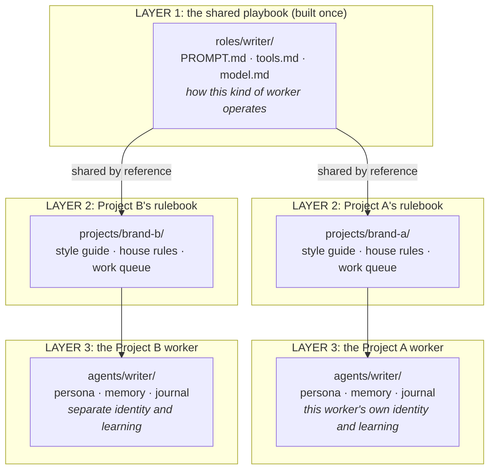
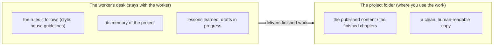
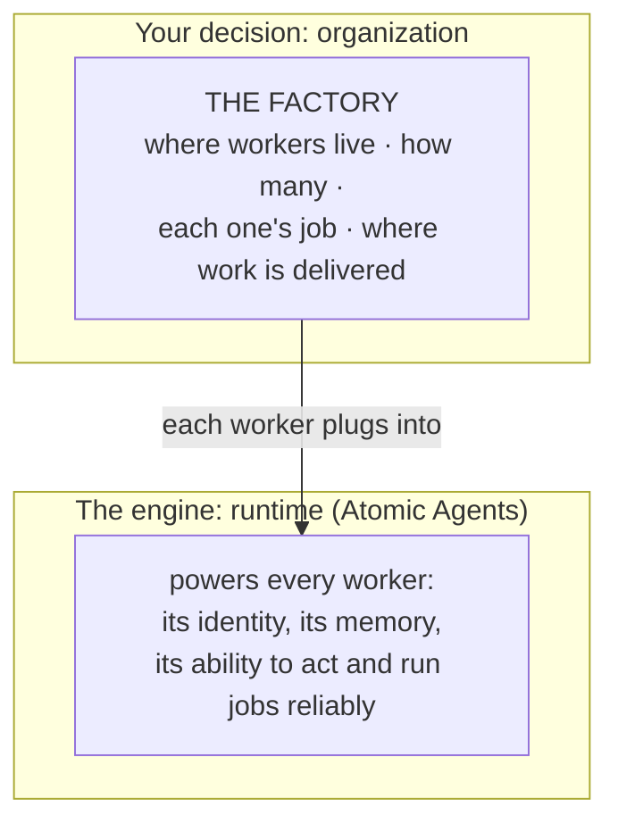

# The Factory Pattern

*A way to use Atomic Agents: build an AI worker's playbook once, then run a separate, isolated copy of it for each project.*

You sometimes build an AI agent that isn't really about one project. It's a production machine. One writes your marketing content. One writes your fiction. One triages your support tickets. The skill, the prompts, the judgment you poured into it would serve any project, not just the first one.

That creates a problem worth naming before you hit it:

- You don't want to **rebuild** that worker from scratch every time a new project needs it. You'd redo all the hard-won tuning, and the copies would drift apart over time.
- You also don't want **one** worker juggling every project at once, because a single brain with access to everything eventually mixes things up. It drops a sales line into your novel, or pulls one client's facts into another client's draft.

The **factory pattern** is the third option, and it's the one this framework is built to support natively. Write the playbook once. Run a separate worker for each project. None of them can see another project's material, and none of them rebuilt the playbook.

The rest of this doc shows how that maps onto Atomic Agents. The short version: **a factory isn't a new feature you install. It's a way of arranging the framework's existing [three-layer cascade](../spec/06-multi-agent-projects.md) (spec/06, shipped).** Nothing gets added to the framework to make factories work.

---

## Three ways to reuse a worker

| Approach | What it is | The catch |
|---|---|---|
| **One worker, every project** | A single agent handles all projects at once. | Mixes them up. One bad memory recall or a broad file read drops project A's context into project B's output. Isolation depends on the agent behaving, not on structure. |
| **A new worker from scratch** | Train a brand-new agent for each project. | Wasteful. You redo all the dialed-in work every time, and the copies drift apart as you fix one but not the others. |
| **One playbook, a worker per project** | Write the master playbook once, then run a fresh worker per project that builds on it. | No real catch. This is the factory pattern: you reuse the expensive work *and* keep projects from bleeding into each other. |

The factory pattern is option three. "Factory" means an **agent product line**, not one shared brain.

---

## How the pieces stack

A factory is three layers. The framework reads all three and stacks them into one running agent every time the worker runs. There's no copy step and no build step.



Read it top to bottom:

- **Layer 1, the shared playbook (`roles/`).** How a kind of worker operates: its core prompt, the tools it may use, the model it runs on. You build this once. Every project's worker reads it live.
- **Layer 2, the project's rulebook (`projects/<project>/`).** Everything specific to one project that every worker on it should see: the style guide, house rules, the shared work queue.
- **Layer 3, the worker (`projects/<project>/agents/<role>/`).** One project's instance of a role. It has its own persona, its own memory, its own journal. This is the part that's fully isolated.

Two projects in the diagram share **one** `roles/writer` playbook but run **two** separate workers with two separate memories. Improve the playbook once and both workers pick it up on their next run. Neither can read the other's notes.

---

## What goes where (the one rule to remember)

The worker keeps its working notes. The project gets the finished goods.



Drafts, memory, and lessons stay on the worker's desk until the work is done. The finished product gets delivered out to the folder where you actually use it. The worker's tool permissions express this: its write-allowlist points finished output at the project folder, while its private notes stay in its own folder. (How strictly those writes are confined depends on the runtime you run the worker under, covered in the isolation note below.)

---

## On disk

Here's a content factory that serves two brands, a coffee company and a credit union. Same playbook, two isolated workers. (The brand names are made up.)

```
content-factory/                          # the factory
├── roles/                                # LAYER 1: the shared playbook, built once
│   ├── writer/    PROMPT.md tools.md model.md
│   └── editor/    PROMPT.md tools.md model.md
└── projects/
    ├── brewhaus-coffee/                  # LAYER 2: this brand's shared context
    │   ├── style_guide.md                #   voice, do's and don'ts every role sees
    │   ├── house_rules.md
    │   ├── queue/                         #   project-scoped work queue
    │   └── agents/                        # LAYER 3: a worker per role, isolated
    │       ├── writer/  persona/ memory/ journal/
    │       └── editor/  persona/ memory/ journal/
    └── summit-credit-union/              # another brand. SAME roles/, separate workers
        ├── style_guide.md                #   (a compliance-bound voice, totally different)
        ├── house_rules.md
        ├── queue/
        └── agents/
            ├── writer/  persona/ memory/ journal/
            └── editor/  persona/ memory/ journal/

published/                                # the FINISHED PRODUCT lives where you use it
├── brewhaus-coffee/...
└── summit-credit-union/...
```

The runnable agent is the **worker folder** at `projects/<project>/agents/<role>/`. This exact `roles/` + `projects/<project>/agents/<role>/` shape is what switches the cascade on. When the framework runs a worker, it stacks the shared role, the project's rulebook, and the worker's own persona and memory into one agent at load time.

Because each worker is its own agent folder (its own persona, memory, and journal), the coffee writer never *sees* the credit union's material. When the runtime loads a worker, it opens only that worker's role, project, and instance folders. A different project's worker is a different folder the runtime never reads during that run. So contamination of *inputs* isn't a rule the agent has to remember; it's the load path.

(One caveat worth stating plainly: what a worker can *read* is structural, as above. What it can *write* depends on the runtime it's running under. A sandboxed or helper-mediated runtime confines writes to the worker's allowlist; the bare Claude-skill runtime is honor-system on writes. See [spec/01](../spec/01-anatomy.md) for the per-runtime conformance table. For real isolation guarantees, run workers on a sandboxed runtime.)

---

## Running a worker

One setting points at your factories. Set `ATOMIC_AGENTS_ROOT` to the folder that holds them, then run a worker by passing its folder path as the name:

```bash
atomic-agents run content-factory/projects/brewhaus-coffee/agents/writer \
  --work-item "Draft the spring roast launch email"
```

The framework stacks the three cascade layers automatically. There's nothing to compile first.

Workers hand off to each other through the project's `queue/` folder, not by calling each other directly. A writer drops its result in the queue; the editor picks it up on its next run. That's how a writer → editor pipeline flows while keeping each worker a clean, separate process.

These are two different mechanisms, worth not conflating. The `queue/` is an **asynchronous** handoff: one worker finishes and the next picks the work up on a later run. That's separate from **delegation** (covered below), where a coordinator calls a specialist live, inside a single run, and waits for the answer. Queue = async pipeline between runs; delegation = sync sub-call within a run.

---

## Reuse without copying (the "build once" part, made real)

This is the whole point of the pattern, and the framework does it for you.

- **The playbook is shared by reference, not copied.** One `roles/writer/PROMPT.md` serves every project. There are no duplicate copies to keep in sync.
- **Improve the playbook once and every worker picks it up** on its next run. Nothing to re-stamp, no refresh script to run.
- **Per-project differences live in layers 2 and 3:** the project's style guide and house rules (layer 2), and the worker's own persona and memory (layer 3). A worker can also override the role's tools or model with its own `tools.md`/`model.md` (a common move: one project's writer runs a bigger model than another's). The divergence is visible in a file, not hidden in code. Changing the core *mechanics* is the exception, and that forks the role rather than overriding it in place (see the freeze note below).

The tradeoff to know: because the playbook is read live, editing a role hits **every** project on its next run. That's the price of zero-maintenance reuse, and with a handful of projects per factory you'd notice a bad change immediately. If one project genuinely needs different mechanics, or you want to freeze it on an older playbook, you **fork the role**: copy `roles/writer/` to a new role (say `roles/writer-frozen/`) and point that project's worker at it. The framework deliberately doesn't let a single worker override the shared `PROMPT.md` in place; divergent mechanics become their own role (the same way you'd split `writer` into `writer-noir` and `writer-scifi`). See [spec/06](../spec/06-multi-agent-projects.md#override-rules) for the exact override rules.

> **Don't build a "compile the factory" step.** The cascade assembles at load time and needs none. (There is a `bundle` command, but it's a read optimization for running agents as a Claude skill, not a build pipeline.)

---

## Where Atomic Agents fits

Here's the part that ties it together, and it's the reason a factory needs nothing new from the framework.

A factory is an **organizing decision**: where your workers live, how many there are, what each one's job is, and where the finished work gets delivered. The thing that actually makes each worker able to think, remember, and act is the **engine** underneath, which is Atomic Agents.



You set up the factory. Atomic Agents powers each worker. You don't change the engine to add a factory; you place a worker and plug it in. Two clean layers, neither doing the other's job.

**In one sentence:** factories decide where your workers live and how you reuse them; Atomic Agents makes them run.

---

## Beyond one factory (where this is heading)

Everything above works **today** on the shipped three-layer cascade ([spec/06](../spec/06-multi-agent-projects.md), locked). A few capabilities that make running *many* factories easier are still in progress. They're listed here so the picture is honest, not because you need them to start:

- **Fleet discovery and governance** ([spec/51](../spec/51-agent-registry-backend.md), draft). Because each worker is a real agent, a registry can enumerate every worker across all your factories, and a per-worker `governance.md` can record who owns it and what it's allowed to do (read-only, draft-only, may-send). The first piece (the filesystem registry, wired into the dashboard and `doctor`) has shipped; the fuller discovery and governance surface is still in progress.
- **A fleet console and management CLI** (spec/52 and spec/55, draft). Ways to observe and operate a whole fleet of workers at once.
- **Durable, human-gated production runs** (the "playbook conductor," planned). A resumable engine for multi-stage work with approval gates (outline → draft → *your approval* → revise → deliver) that can pause for days and resume exactly where it left off. Until it lands, a factory's multi-stage production runs through plain `agent.call()`, the project `queue/`, and manual approval gates.

The cost of a worker team is already bounded today: collaboration uses [one-level delegation](../spec/15-delegation.md) (a coordinator delegates to a specialist, and that's the end of the chain), and spend is [capped across the whole call tree](../spec/09-cost-observability.md), so a factory's internal team is a shallow, cost-bounded process by construction.

---

## In short

- A factory is a **shared playbook plus one isolated worker per project**. You build the expensive part once and reuse it without mixing projects up.
- It maps directly onto the framework's **three-layer cascade** (`roles/` + `projects/<project>/` + `agents/<role>/`), which is shipped. No new framework feature is involved.
- The worker keeps its notes; the project gets the finished goods.
- Input isolation is **structural** (a worker only ever reads its own folders). Write-confinement depends on the runtime you run it under, so run workers on a sandboxed runtime for real guarantees.

> Built on the three-layer cascade. See [spec/06: Multi-agent projects](../spec/06-multi-agent-projects.md) for the mechanism this pattern arranges.
