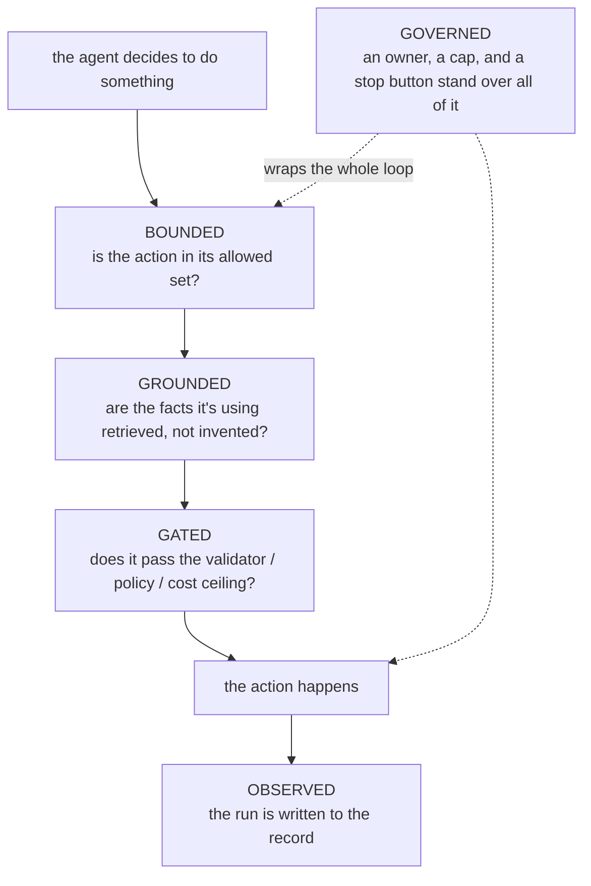
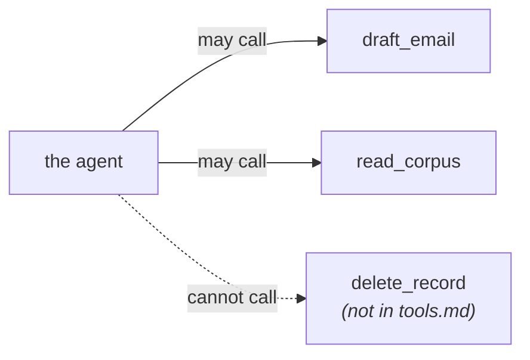
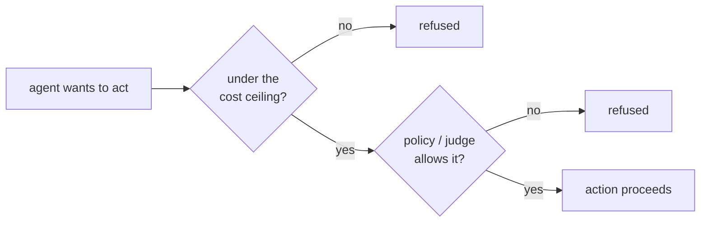
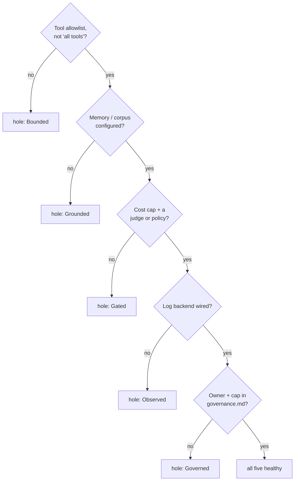

# The Five Disciplines

*A way to use Atomic Agents: a five-part checklist for whether an AI agent is safe to put to work, and the framework primitive that enforces each part.*

Most AI projects don't fail because the model is dumb. They fail because someone shipped an agent that could take actions nobody bounded, on facts nobody grounded, with no gate, no record, and no off switch. The agent worked in the demo, then did something expensive or wrong in week three, and there was no structure to catch it.

There's a clean way to name what a well-behaved agent needs. Five properties. An agent that has all five is one you can trust with real work; an agent missing one has a specific, nameable hole. The framing isn't ours originally (it's a good distillation that shows up across the agent-governance world), but it maps unusually cleanly onto Atomic Agents, because the framework was built to enforce each of the five as a real mechanism, not a guideline.

The five:

| Discipline | The plain-English question | "Healthy" looks like |
|---|---|---|
| **Bounded** | Does it stay in its lane? | A fixed list of actions it may take, not "anything." |
| **Grounded** | Does it check its facts? | Answers come from retrieved sources, not just the model's memory. |
| **Gated** | Does it check before acting? | A validator, a policy, or a cost ceiling sits between intent and action. |
| **Observed** | Is anything hidden? | Every run leaves a record you can read later. |
| **Governed** | Is there a stop button? | An owner, a spend cap, and a way to halt or roll back. |

The rest of this doc walks each one and points at the exact part of the framework that makes it true. The short version: **you don't bolt these on. They're the framework's existing backend protocols, viewed through a governance lens.** An agent built the normal way already has most of them; the value of the checklist is spotting the one you skipped.

---

## How the five stack up

Four of the five sit *in the path* of a single action: bound it, ground it, gate it, then record it. The fifth (governed) wraps the whole loop: it's the owner, the cap, and the kill switch that exist whether or not any single action is running.

---

## 1. Bounded — does it stay in its lane?

An unbounded agent picks *what kind of thing* to do, not just the details. That's the failure: you wanted it to draft an email and it decided the right move was to delete a record. Bounding means the set of actions is finite and declared up front.

**In Atomic Agents:** an agent's tools are an explicit allowlist in `tools.md`, registered through the **ToolRegistry** backend. The agent can call the tools you listed and no others. There's no "and also any tool it can reach" escape hatch, and the registry refuses to silently overwrite a tool with a different one.

> Bounded = the action vocabulary is a list you wrote, not a capability the model discovered.

---

## 2. Grounded — does it check its facts?

A grounded agent answers from retrieved material, not from whatever the model happened to absorb in training. The ungrounded failure is confident invention: a plausible answer with no source behind it.

**In Atomic Agents:** grounding is the **Memory** and **Corpus** backends, plus INDEX-driven recall. Instead of dumping everything into context and hoping, the agent reads a small index, decides which one to three notes are relevant, and loads those. Its answer traces back to specific retrieved notes, and the recall path is auditable.

> Grounded = the answer points at a source the agent actually read, not a memory it might have.

---

## 3. Gated — does it check before acting?

A gate is anything that sits between "the agent wants to act" and "the action happens" and can say no. Without gates, the first sign of a bad action is the consequence.

**In Atomic Agents** there are several, and an agent can use any combination:

- **Cost guardrails.** Every `agent.call()` checks spend before the first model call and re-checks each turn. Helpers reserve worst-case before dispatch. Delegated work is clamped to the smaller of child and parent remaining budget (the *tree-cap*), so "run an army" can't become "go bankrupt."
- **Judge / Policy / Mandate backends.** A judge can score an output before it's accepted. A policy can refuse a class of action. A mandate can require a spend authorization.

> Gated = there is a thing that can say no, and it runs *before* the action, not after the damage.

---

## 4. Observed — is anything hidden?

An observed agent leaves a trail. Every run, every tool call, every delegation writes a record you can read after the fact. The hidden-agent failure is the one where something went wrong and there's no way to reconstruct what it did or why.

**In Atomic Agents:** every run writes a JSONL line carrying a `run_id`. Helper, tool, and delegate calls write child lines that link back via `parent_run_id`, and the parent run record rolls them up inline. The dashboard reads these streams (OTel trace export is emerging, to carry them to external tooling). Memory mutations carry their own audit shape (version snapshots you can diff or restore).

> Observed = after the fact, you can answer "what did it do, what did it cost, and why" from the record, not from memory.

---

## 5. Governed — is there a stop button?

Governance is the layer that exists whether or not any single action is running: someone owns this agent, its spend is capped, and there's a way to halt it. The ungoverned failure isn't one bad action; it's nobody being responsible and nothing being able to stop it.

**In Atomic Agents:** the cost tree-cap bounds total spend across the whole call tree. Refusals are first-class (the agent can decline). Memory versioning gives rollback. And each agent carries a `governance.md` recording who owns it, what tier of permission it runs at, and where it sits in its lifecycle.

> Governed = a named owner, a hard spend ceiling, and a documented way to halt or roll back.

---

## Reading an agent against the five

The checklist is most useful as a quick read of an agent you're about to trust with something real. Walk the five and name the holes:

A useful property of this framing: **an agent built the normal way passes most of it by default.** Sensible cost guardrails are on without tuning. Memory recall is configured out of the box. The audit trail is structural. So the checklist usually surfaces one specific gap (an agent that was handed every tool, or one running without an owner recorded) rather than a wall of red.

---

## What's shipped vs. what's coming

Everything that *enforces* the five disciplines is **shipped today** as backend protocols — ToolRegistry, Memory, Corpus, Judge, Policy, Mandate, the cost guardrails and tree-cap, the Log backend (with OTel trace export emerging), memory versioning, and the `governance.md` carried by the AgentRegistry backend ([spec/51](../spec/51-agent-registry-backend.md)). You can build a fully-disciplined agent now.

Two tools that make the *checklist itself* easier to run across a fleet are in progress (listed so the picture is honest, not because you need them to apply the five):

- **A governance-completeness gate** ([#629](https://github.com/dep0we/atomic-agents-stack/issues/629)). A `doctor` check (and an optional pre-merge CI gate) that refuses an agent whose `governance.md` is present but incomplete — no owner, no accepter, no lifecycle. This turns "Governed" from a thing you remember to check into a thing the framework checks for you.
- **A five-disciplines posture scorecard** ([#630](https://github.com/dep0we/atomic-agents-stack/issues/630)) in the Fleet Console. A read-only, per-agent A–F grade across the five, derived from each agent's configured backends. The checklist above, computed and rolled up across a whole fleet.

One refuses at build time; the other reports across the running fleet. Two lenses on the same five disciplines.

---

## In short

- Five properties decide whether an agent is safe to put to work: **Bounded, Grounded, Gated, Observed, Governed.**
- Each maps onto a shipped framework primitive — a tool allowlist, memory/corpus recall, the gate stack (cost + judge/policy/mandate), the JSONL audit trail, and the cost tree-cap plus `governance.md`.
- You don't install these. An agent built the normal way already has most of them; the checklist's job is to surface the one you skipped.
- Tools to run the checklist automatically across a fleet (a completeness gate and a posture scorecard) are in progress; the disciplines they check are enforceable today.

> Built on the backend protocols. See [docs/protocols-shipped.md](../protocols-shipped.md) for the per-protocol summary, and [spec/51](../spec/51-agent-registry-backend.md) for the `governance.md` shape behind "Governed."
